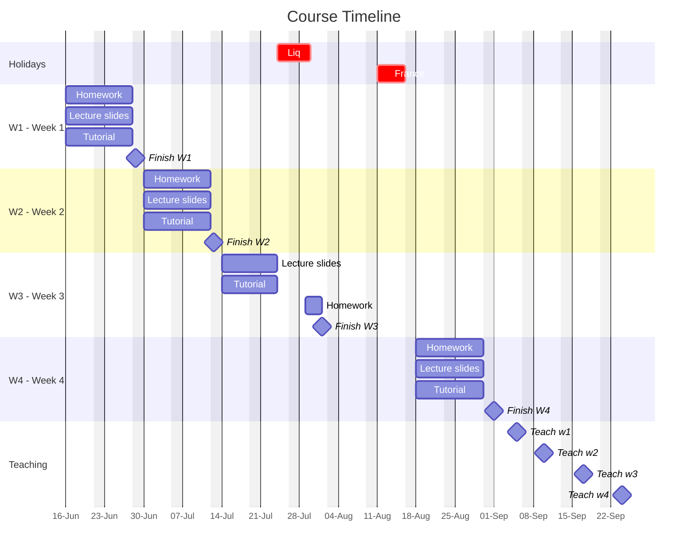

# Create materials for C1

```mermaid

gantt
    title Course Timeline
    dateFormat  DD-MMM-YYYY
    excludes weekends
    axisFormat  %d-%b
    tickInterval 1week
    weekday monday


    section Holidays
    Liq         :crit, 24-Jul-2025, 28-Jul-2025
    France      :crit,  hol, 11-Aug-2025, 5d

    section W1 - Week 1
    Homework                  :,16-Jun-2025, 10d
    Lecture slides            :,16-Jun-2025, 10d
    Tutorial                  :, 16-Jun-2025, 10d
    Finish W1                 :milestone, end1, 27-Jun-2025, 1d

    section W2 - Week 2
    Homework                  :, after end1, 10d
    Lecture slides            :, after end1, 10d
    Tutorial                  :tut2, after end1, 10d
    Finish W2                 :milestone, end2, 11-Jul-2025, 1d

    section W3 - Week 3
    Lecture slides            :,after end2, 8d
    Tutorial                  :tut3, after end2, 8d
    Homework                  :,29-Jul-2025, 3d
    Finish W3                 :milestone, end3, 1-Aug-2025, 0d

    section W4 - Week 4
    Homework                  :,after hol, 10d
    Lecture slides            :, after hol, 10d
    Tutorial                  :tut4, after hol, 10d
    Finish W4                 :milestone, end4, after tut4, 0d

    section Teaching
    Teach w1                  :milestone, 5-Sep-2025, 0d
    Teach w2                  :milestone, 10-Sep-2025, 0d
    Teach w3                  :milestone, 17-Sep-2025, 0d
    Teach w4                  :milestone, 24-Sep-2025, 0d


```